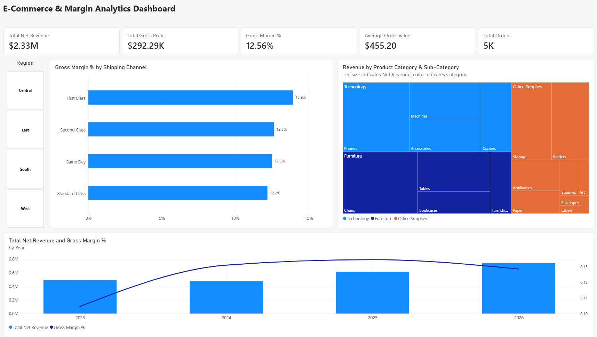

# End-to-End Business Analytics & KPI Dashboard

[](https://www.postgresql.org/)
[](https://powerbi.microsoft.com/)
[](https://www.jetbrains.com/datagrip/)
[](LICENSE)

An end-to-end business intelligence solution that normalizes 10,000+ commercial transaction records into a cloud-hosted PostgreSQL Star Schema, paired with an interactive Power BI executive dashboard to analyze margin variances, fulfillment speed, and product profitability.

---

## Dashboard Preview



---

## Project Architecture

```text
[Kaggle Superstore Dataset] (Raw CSV ~10K rows)
              │
              ▼
    [Neon Cloud PostgreSQL]
   (Staging Table: raw_superstore)
              │
              ▼
     [SQL ETL Normalization] ──► Kimball Star Schema:
                                   ├── fact_orders (10,194 rows)
                                   ├── dim_channels (4 channels)
                                   ├── dim_customers (804 customers)
                                   └── dim_products (1,862 products)
              │
              ▼
   [Analytical SQL Queries] ──► CTEs, Window Functions (ROW_NUMBER, LAG)
              │
              ▼
    [Power BI Desktop] ───────► Direct Import, Star Schema Model, Custom DAX
```

---

## Dataset Overview

* **Source:** [Superstore Sales Dataset on Kaggle](https://www.kaggle.com/datasets/himanshuuike/superstore-sales-dataset)
* **Dataset Scope:** 10,194 transactional order records across commercial retail sales.
* **Domain:** Commercial retail and e-commerce across Technology, Furniture, and Office Supplies.

### Raw Data Attributes:
| Category | Attributes Included |
| :--- | :--- |
| **Order & Logistics** | Order ID, Order Date, Ship Date, Ship Mode (Shipping Channel) |
| **Customer Profile** | Customer ID, Customer Name, Segment (Consumer, Corporate, Home Office), Geography (City, State, Region, Postal Code) |
| **Product Hierarchy** | Product ID, Product Name, Category, Sub-Category |
| **Financial Metrics** | Gross Sales, Quantity, Discount Rate, Profit (COGS derived) |

### Data Transformation & Staging:
The raw dataset was ingested into an unnormalized staging table (`raw_superstore`) and programmatically transformed via SQL into a 3rd Normal Form / Kimball dimensional model:
* **`fact_orders`**: 10,194 line items with reconstructed gross revenue, dollar discounts, COGS, and gross profit.
* **`dim_channels`**: 4 fulfillment methods with assigned platform/logistics fee rates.
* **`dim_customers`**: 804 deduplicated customer records across 4 US regions.
* **`dim_products`**: 1,862 distinct SKUs categorized across 17 sub-categories.

---

## Key Business Insights & Recommendations

1. **Fulfillment Channel Margin Variance:**
   * **Finding:** *First Class* shipping generates the highest gross margin (**13.9%**), whereas *Standard Class* carries the lowest margin (**12.2%**) despite accounting for over 60% of all transaction volume.
   * **Recommendation:** Introduce threshold-based shipping incentives (e.g., free expedited shipping on orders over $150) to shift volume toward higher-margin fulfillment channels.

2. **Category Margin Compression & Discount Leakage:**
   * **Finding:** While *Technology* maintains healthy margins (~17%), the *Furniture* category suffers from margin compression, with sub-categories such as *Tables* and *Bookcases* experiencing negative profit contributions when discounts exceed 20%.
   * **Recommendation:** Implement a 15% discount ceiling on bulky furniture lines to prevent negative-margin order fulfillment.

3. **Customer Segment Value:**
   * **Finding:** The *Consumer* segment generates the highest overall revenue, but *Corporate* and *Home Office* clients yield higher Average Order Value (AOV), ordering in higher bulk quantities.
   * **Recommendation:** Develop targeted B2B bundled packages (ergonomic chairs + docking stations) aimed at corporate and home office accounts.

---

## Tech Stack

* **Database Engine:** PostgreSQL 16 (Hosted on [Neon.tech](https://neon.tech))
* **Database Client / IDE:** JetBrains DataGrip
* **Business Intelligence:** Microsoft Power BI Desktop
* **Languages:** SQL, DAX (Data Analysis Expressions)
* **Data Source:** [Superstore Dataset on Kaggle](https://www.kaggle.com/datasets/himanshuuike/superstore-sales-dataset)

---

## Repository Structure

```text
├── sql/
│   ├── framework.sql                  # DDL creating the Star Schema (PKs, FKs, Indexes)
│   ├── transform_superstore.sql       # ETL logic mapping staging data to Star Schema
│   ├── load_data.sql                  # Initial seed data script
│   └── business_kpis.sql              # CTEs, Window functions, & analytical queries
├── dashboard/
│   ├── KPI_dashboard.pbix             # Completed Power BI report file
│   └── dashboard_preview.png          # High-resolution dashboard image
├── .gitignore                         # Excludes IDE caches, credentials, & raw data
└── README.md                          # Project documentation
```

---

## Core DAX Measures

The Power BI model relies on explicit DAX measures rather than implicit aggregations:

* **Total Net Revenue:**
  ```dax
  Total Net Revenue = SUM('public fact_orders'[net_sales])
  ```
* **Total Gross Profit:**
  ```dax
  Total Gross Profit = SUM('public fact_orders'[gross_profit])
  ```
* **Gross Margin %:**
  ```dax
  Gross Margin % = DIVIDE([Total Gross Profit], [Total Net Revenue], 0)
  ```
* **Total Orders:**
  ```dax
  Total Orders = DISTINCTCOUNT('public fact_orders'[order_id])
  ```
* **Average Order Value (AOV):**
  ```dax
  Average Order Value = DIVIDE([Total Net Revenue], [Total Orders], 0)
  ```

---

## How to Reproduce

### 1. Database Setup
1. Create a free PostgreSQL instance on [Neon.tech](https://neon.tech).
2. Connect to your database using **DataGrip** (or `psql`).
3. Run `sql/framework.sql` to generate the Star Schema tables.
4. Import the Kaggle Superstore CSV into staging table `raw_superstore`.
5. Execute `sql/transform_superstore.sql` to populate the normalized tables.
6. (Optional) Run `sql/business_kpis.sql` to review SQL-based analytical aggregations.

### 2. Power BI Dashboard
1. Open Power BI Desktop.
2. Open `dashboard/KPI_dashboard.pbix`.
3. To connect to your own database instance, go to **Home > Transform Data > Data source settings** and update the server address.
4. Click **Refresh** to reload the dataset.
